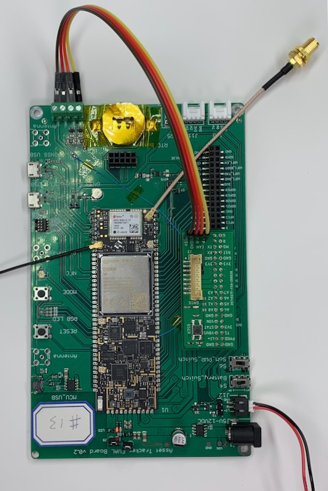
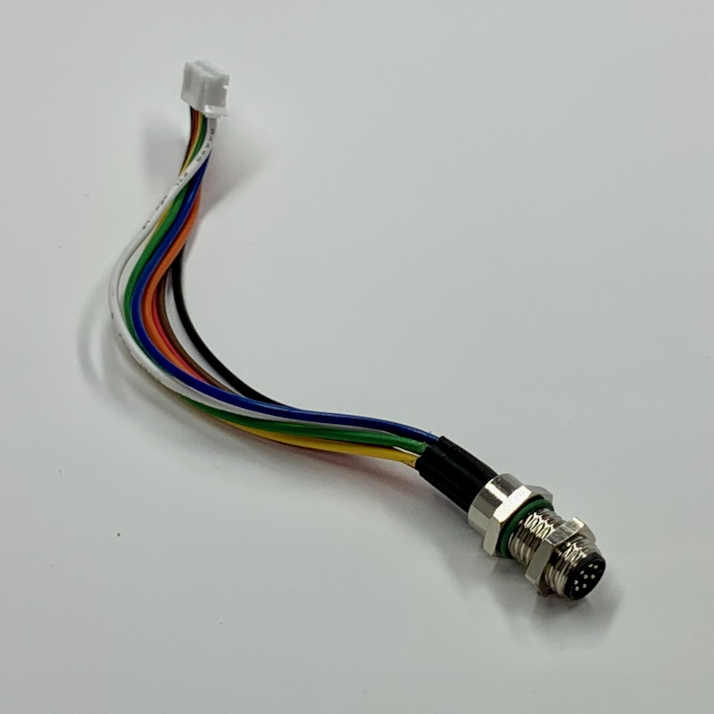

# M8-Eval-Adapter

**Hardware design to facility prototyping Tracker One designs on the Tracker SoM Evaluation Board**

This is a simple board you can assemble that makes it easier to prototype designs that will eventually use the Tracker One or Tracker SoM Carrier Board, using the Tracker SoM Evaluation Board.

It fits on the 40 pin expansion connector on the Tracker SoM Evaluation Board and includes features that are on the Tracker One and Tracker Carrier Board:

- B8B-PH connector on the board, the same connector as on the Tracker Carrier Board
- Thermistor (temperature sensor) connected to A0.
- USER button connected to A1
- Blue GNSS LED connected to A2
- CAN connection

The CAN connection is necessary because CAN is not exposed on the 40-pin header. Short wires connect to the screw terminals on the Tracker SoM evaluation board so the CAN will be available on the M8 connector.

**Note:** The Tracker One supports up to 30V on the M8 connector. This adapter board does not have the same power supply as the Tracker One and Tracker Carrier Board. **This adapter board only supports up to 12V using the B8B-PH as a power input!** 

## About the M8 and B8B-PH Connector

The Tracker Carrier Board in the Tracker One has a B8B-PH connector on the board.

The Tracker One has a small cable with a PHR-8 connector (fits into the B8B-PH) on one end and an M8 8-pin male IP67 on the other. The M8 end fits into a hole in the case. This is the cable inside the Tracker One:

Your Tracker One project will typically use a M8 8-pin female cable. Here's one that has wires on the other end.

You'd typically connect those wires to your custom expansion board using one of several methods:

- Terminate with pins in a PHR-8 to mate with a B8B-PH on your expansion board
- Terminate with screw terminals on your board
- Terminate by soldering the wires to your board

For prototyping, you can just skip the M8 cable and use PHR-8 to wires, or a PHR-8 to PHR-8 cable, as in this example:

## Design

### Schematic

### Board

The Eagle CAD files (.sch and .brd) are in the [Github repository](https://github.com/rickkas7/M8-Eval-Adapter), along with the Gerber files.

## BoM (Bill of Materials)

| Quan | Part | Example | Price | 
| :---: | --- | --- | ---: |
| 1 | 100K NTC Thermistor | [Panasonic ERT-J1VR104FM](https://www.digikey.com/product-detail/en/panasonic-electronic-components/ERT-J1VR104FM/P122067CT-ND/7069667) | $0.39 |
| 2 | 100 ohm resistor 0603 | [Panasonic ERJ-3GEYJ101V](https://www.digikey.com/product-detail/en/panasonic-electronic-components/ERJ-3GEYJ101V/P100GCT-ND/134714) | | 
| 1 | 100K resistor 0603 | [Panasonic ERJ-3EKF1003V](https://www.digikey.com/product-detail/en/panasonic-electronic-components/ERJ-3EKF1003V/P100KHCT-ND/198110) | | 
| 1 | Blue LED 0603 | [Lite-On LTST-C193TBKT-5A](https://www.digikey.com/product-detail/en/lite-on-inc/LTST-C193TBKT-5A/160-1827-1-ND/2355044) | $0.47 |
| 1 | 4.5mm momentary switch | [E Switch TL3305AF160QG](https://www.digikey.com/product-detail/en/e-switch/TL3305AF160QG/EG5350CT-ND/5816195) | $0.20 |
| 1 | B8B-PH Connector | [JST B8B-PH-SM4-TB(LF)(SN)](https://www.digikey.com/product-detail/en/jst-sales-america-inc/B8B-PH-SM4-TB-LF-SN/455-1740-1-ND/926837) | $1.00 |
| | Male header pins 0.1" | [Sullins PRPC040SAAN-RC](https://www.digikey.com/product-detail/en/PRPC040SAAN-RC/S1011EC-40-ND/2775214) | | 

## Assembly Diagram

